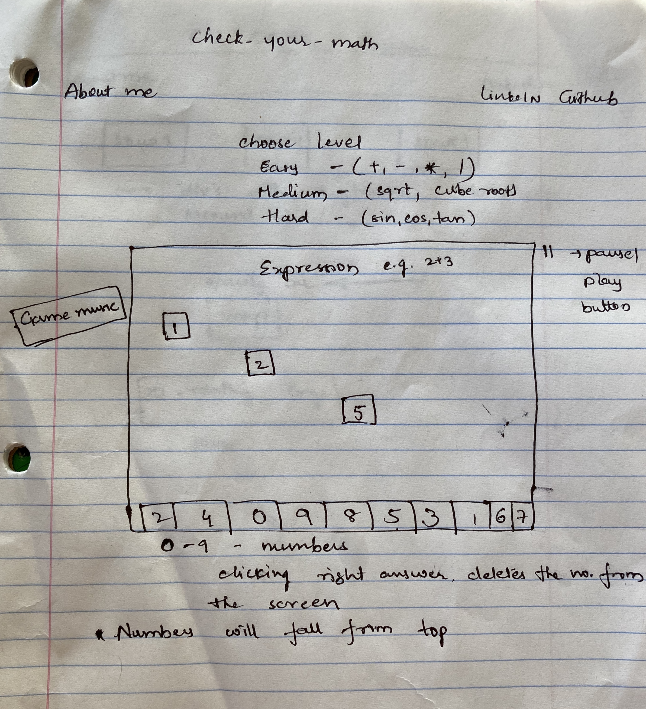

# Check-Your-Math

# CSS-Demo
[Live Link coming soon](https://pages.github.com/)

## Overview

This is a single player game.
  * Main screen displays a math operation
  * Player can choose answer from the numbers on the screen

## Functionality

## MVPs
  * Make the falling numbers and display on screen
  * Genarate equations
  * Make the falling numbers clickable, register the clicked number, right answer should delete the number
  * Bonus:
    * Add medium and hard levels for Math equation
    * Integrate Web music API to add game sounds

## Classes
  * Util
    * Utility code for the velocity of fall of numbers
  * MovingObjects
    * Base class for moving objects
  * Numbers
    * Inherits from movingObjects
  * Equation
    * generates random math equations
  * Game
    * Holds core game functionality
      * Start
  * GameView
    * stores a game instance, 
    * stores a canvas to draw into 

## Wireframes

## Architecture and Technology
CSS, Javascript, HTML, three.js, Web Audio API for game music 

## Implementation Timeline

### Phase 1
  Implement falling numbers on screen
   * create util class
      * const util - generates velocity of fall
      * util.inherits - inheritance
   * create movingobjects class
      * constructor with necessary arguments
      * MovingObject.prototype.move 
      * MovingObject.prototype.draw  (might differ for three.js)
   * create numbers class inheriting form movingobjects
      * function Number
      * Inherits from movingObject
   * create Game class
      * 
### Phase 2
  Generate equations
   * create Equation class
### Phase 3
 * Make numbers clickable
 * delete the number corresponding to the right answer
   * Game.prototype.rightanswer
 * Define logic for game-end
  * Implement game music if time permits
